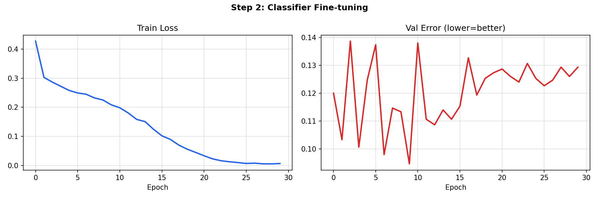
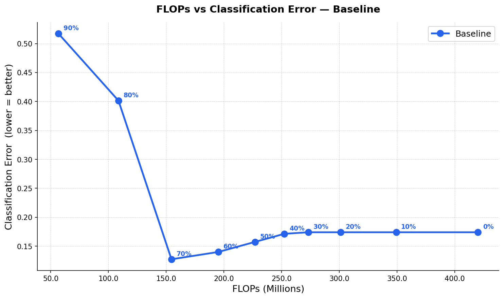
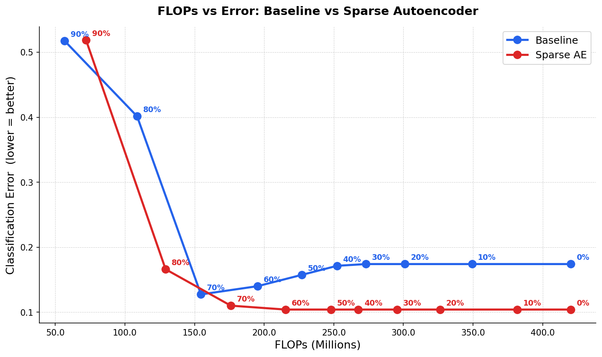

# End-to-End Event Classification with Sparse Neural Networks

Binary classification of particle collision events using sparse convolutional networks.
Built for the ML4Sci GSoC 2026 test task (Task 2d).

---

## What this is

Particle detector data is sparse — most pixels in an event image are zero. I wanted to see if
a network designed specifically for sparse data would work better than just throwing a standard
CNN at it. The paper by Graham & van der Maaten (arXiv:1706.01307) proposes Valid Sparse
Convolution (VSC) which only computes at active pixels and keeps sparsity intact across layers.
I used that as the backbone here.

The pipeline:
1. Pretrain an autoencoder on unlabelled data (no labels needed)
2. Transfer the encoder weights and fine-tune for binary classification
3. Prune the model at different ratios and see how accuracy holds up

---

## Model

The encoder is a 4-stage VSC network. Each stage has two VSC blocks followed by MaxPool:

```
input (B, 8, 125, 125)
  stage 1: VSC(8→16)  × 2 + MaxPool  →  (B, 16, 62, 62)
  stage 2: VSC(16→32) × 2 + MaxPool  →  (B, 32, 31, 31)
  stage 3: VSC(32→64) × 2 + MaxPool  →  (B, 64, 15, 15)
  stage 4: VSC(64→128)× 2            →  (B, 128, 15, 15)
  global avg pool + flatten           →  (B, 128)
```

The VSC block zeros out inactive sites before the convolution and again after, so the
sparsity pattern doesn't bleed into neighbouring pixels across layers. This is the key
difference from a normal conv.

For classification a small head is attached:
```
Linear(128→64) → ReLU → Dropout(0.3) → Linear(64→1)
```

---

## Results

### Autoencoder pretraining — 50 epochs

The loss came down from 0.822 to 0.757. Train and val stayed close throughout
which means the encoder generalised well to unseen event frames.


### Classifier fine-tuning — 30 epochs

After transferring the encoder the classifier reached **90.5% accuracy** (best val error 0.0947).
The training loss dropped fast in the first 10 epochs then flattened out, which is
what you'd expect when starting from a pretrained encoder.



### Pruning experiment

I swept pruning ratios from 0% to 90% using global L1 magnitude pruning. FLOPs are
calculated as dense FLOPs × fraction of non-zero weights.



| Pruning | FLOPs (M) | Error | Accuracy |
|:---:|:---:|:---:|:---:|
| 0% | 420 | 0.174 | 82.6% |
| 10% | 349 | 0.174 | 82.6% |
| 20% | 301 | 0.174 | 82.6% |
| 30% | 273 | 0.174 | 82.6% |
| 40% | 252 | 0.171 | 82.9% |
| 50% | 227 | 0.157 | 84.3% |
| 60% | 195 | 0.140 | 86.0% |
| 70% | 155 | 0.127 | 87.3% |
| **80%** | **109** | **0.401** | **60.0%** |
| 90% | 57 | 0.517 | 48.3% |

The model is surprisingly robust up to 70% pruning — accuracy actually improves slightly
in the 50-70% range which I think is because pruning acts as a regulariser here. It only
really breaks above 80%.

### Bonus — Sparse Autoencoder vs Baseline

Trained a second autoencoder with an L1 penalty on the bottleneck activations to force
sparsity in the latent code, then ran the same pruning sweep on a classifier trained
from that encoder.



The sparse AE encoder gives a noticeably better starting point — 0% pruning error is
0.104 vs 0.174 for baseline, and it stays stable up to 60% pruning before degrading.

---

## Files

```
├── notebook.ipynb        ← everything in one place with outputs
├── requirements.txt
├── models/
│   ├── sparse_cnn.py     ← VSCBlock, encoder, decoder
│   └── autoencoder.py    ← BaselineAE, SparseAE, Classifier
├── utils/
│   ├── dataset.py        ← HDF5 loading
│   └── pruning.py        ← pruning + flop counter
└── assets/               ← plots
```

---

## Running it

```bash
pip install -r requirements.txt
jupyter notebook notebook.ipynb
```

Data should be HDF5 files. Update `DATA_KEY` and `LABEL_KEY` in the first cell to match
your file structure.

---

## References

- Graham & van der Maaten, *Submanifold Sparse Convolutional Networks*, arXiv:1706.01307
- Yang et al., *FoldingNet*, arXiv:1712.07262
